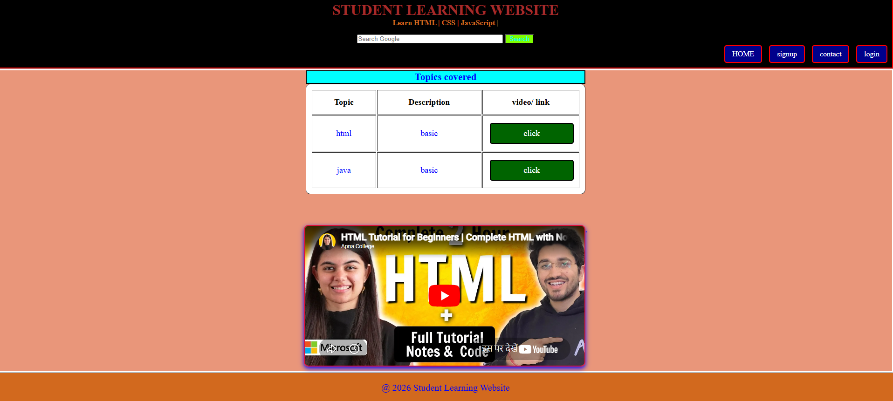
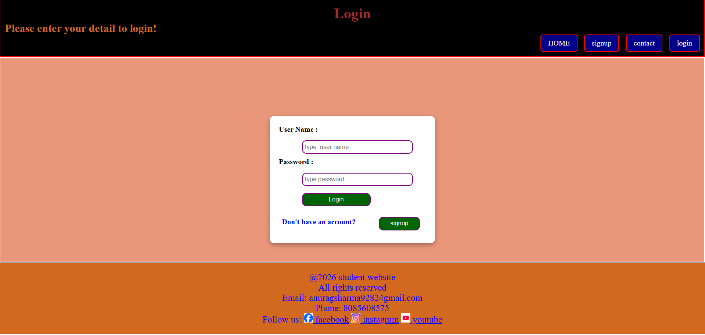
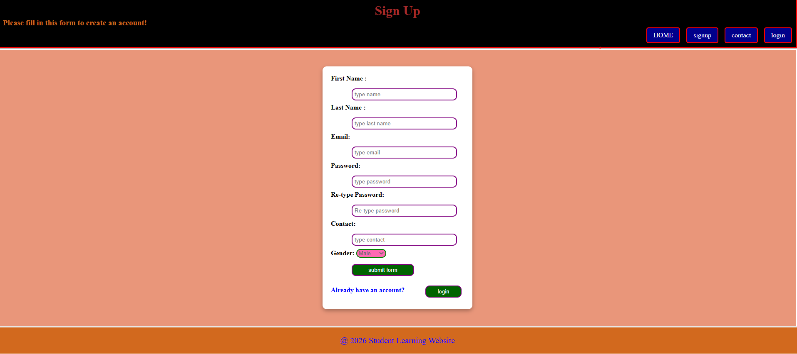
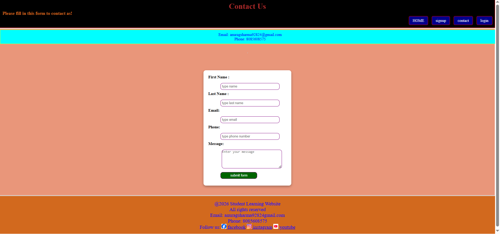

# 🎓 Student Learning Website

This is a simple *Student Learning Website* built using *HTML and CSS*.  
It includes basic pages like Home, Login, Signup, and Contact.

---

## 🚀 Features

- Responsive design (basic)
- Login & Signup forms
- Contact form
- Clean UI design using CSS

---

## 📂 Pages

- 🏠 Home Page
- 🔐 Login Page
- 📝 Signup Page
- 📞 Contact Page

---

## 🛠️ Technologies Used

- HTML
- CSS

---

## 📸 Screenshots

### 🏠 Home Page

### 🔐 Login Page

### 📝 Signup Page

### 📞 Contact Page

---

## 👨‍💻 Author

*Anurag Sharma*

---

## ⭐ Note

This project is made for learning and practice purposes.
